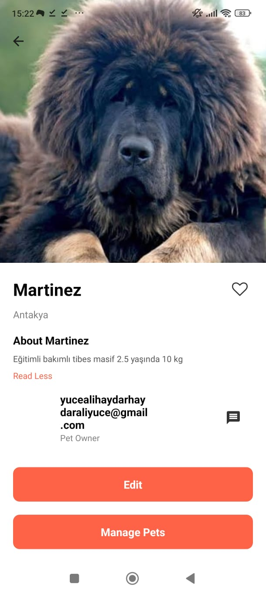

# Proje Adı

Bu proje, **Proje Adı** altında geliştirilen bir [Expo](https://expo.dev) uygulamasıdır. Proje, kullanıcılara **proje amacını kısaca açıklayın (örneğin, hayvan sahiplendirme uygulaması)** sağlamak için geliştirilmiştir.

## 📱 Ekran Görüntüleri

Aşağıda, uygulamanın bazı ekran görüntülerini bulabilirsiniz:




## 🚀 Başlarken

Bu proje, [Node.js](https://nodejs.org/) ve [Expo CLI](https://docs.expo.dev/) gerektirmektedir. Projeyi başlatmak için aşağıdaki adımları izleyin.

### Gereksinimler

- Node.js (v14 veya daha yeni)
- Expo CLI (global olarak yükleyin: `npm install -g expo-cli`)

### Kurulum

Projeyi yerel bilgisayarınıza klonlayın ve bağımlılıkları yükleyin:

```bash
git clone https://github.com/kullanici/proje-adi.git
cd proje-adi
npm install
